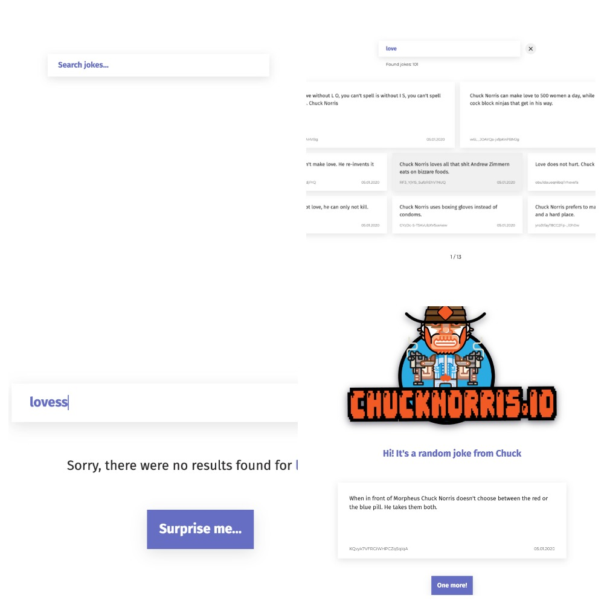

<h1 align='center'> Chuck Norris API Jokes APP</h1>


Deploy [gh-pages](https://greybirbroman.github.io/chuck_test/)
Deploy [Vercel](https://chuck-test.vercel.app/)



## Запуск проекта 
1) Установить зависимости

```bash
npm install
```
2) Запустить проект в режиме разработки на [http://localhost:3000](http://localhost:3000)
```bash
npm run start
# or
yarn start
```

## Технические требования:
- Адаптивная вёрстка от 320px до 1920px
- Поддержка браузеров: последняя версия Chrome
- Использование React или Vue
- Использование любого стейт-менеджера на выбор (Redux, MobX, Effector, Vuex и т.д.)
- Если в дизайне чего-то не хватает, попытаться самостоятельно отобразить в интерфейсе
  
## Реализовано дополнительно:
- Хранение данных в sessionStorage чтобы не терять данные при перезагрузке страницы
- Пагинация списка шуток
- Отдельная страница со случайной шуткой

